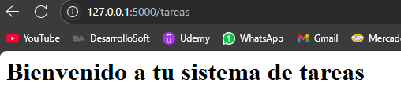
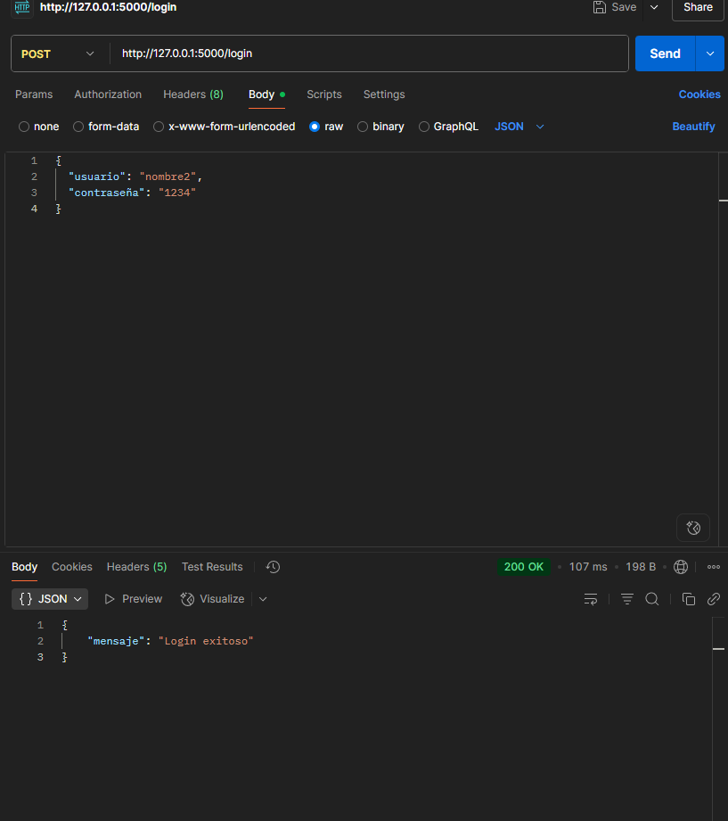
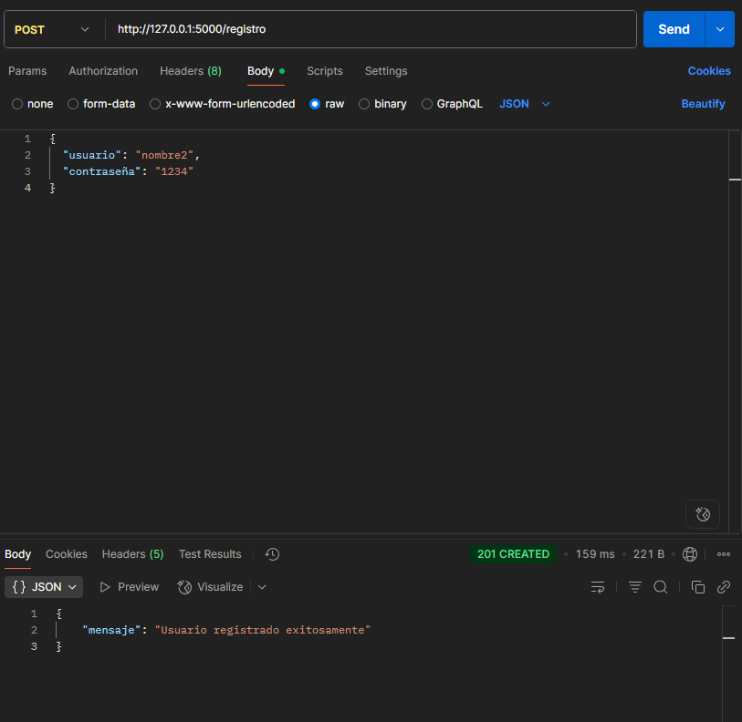

# Sistema de Gestión de Tareas con API y Base de Datos (PFO2)

Este proyecto consiste en una API REST desarrollada con Flask que permite registrar usuarios, iniciar sesión y mostrar una página HTML de bienvenida. La información de los usuarios se almacena de forma persistente en una base de datos SQLite, utilizando contraseñas hasheadas para mayor seguridad.

## Funcionalidades principales

- Registro de usuarios con almacenamiento seguro de contraseñas.
- Inicio de sesión con verificación de credenciales.
- Página HTML de bienvenida accesible tras autenticación.

---

## Requisitos previos

- Python 3.12 (o compatible)
- pip
- Flask

### Instalación de dependencias

```bash
python -m pip install flask
```

# Objetivos del proyecto

 - Al finalizar este trabajo, serás capaz de:
 - Implementar una API REST con Python y Flask.
 - Utilizar autenticación segura mediante contraseñas hasheadas.
- Persistir datos con SQLite.
- Interactuar con la API desde un cliente (como Postman o consola).

# Requisitos previos

- Python 3.12 (o compatible)
- pip
- Flask

```bash
git clone https://github.com/tuusuario/PFO2.git
cd PFO2
```
En python servidor.py ejecutar:
```
pip install flask

```
## Endpoints disponibles
POST /registro
Registra un nuevo usuario.

Body JSON de ejemplo:
```
{
  "usuario": "nombre",
  "contraseña": "1234"
}
```
# Respuestas posibles:

- 201 Created: Usuario registrado exitosamente.

- 409 Conflict: El usuario ya existe.

- 400 Bad Request: Datos incompletos.
# POST /login
Verifica credenciales del usuario.
Body JSON de ejemplo:
```
{
  "usuario": "nombre",
  "contraseña": "1234"
}
```
# Respuestas posibles:
- 200 OK: Login exitoso.
- 401 Unauthorized: Credenciales inválidas.
# GET /tareas
Devuelve una página HTML sencilla con un mensaje de bienvenida.
# Preguntas Conceptuales
## ¿Por qué hashear contraseñas?
Porque almacenar contraseñas en texto plano es riesgoso. Al hashearlas, incluso si alguien accede a la base de datos, no podrá ver las contraseñas reales. El hashing es una medida básica de seguridad para proteger la identidad de los usuarios.
## Ventajas de usar SQLite
- SQLite es ideal para proyectos pequeños y medianos. Algunas ventajas son:
- No requiere instalación de un servidor.
- Los datos se guardan en un solo archivo .db.
- Es muy fácil de usar y configurar.
- Perfecto para prototipos o proyectos educativos como este.
#Captturas de pantalla:
## Tareas:

## Login:

##Registro:

